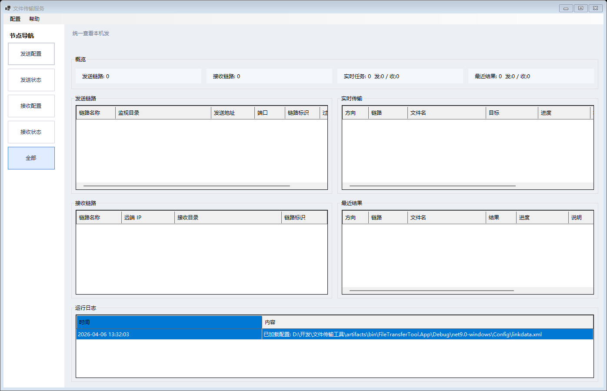
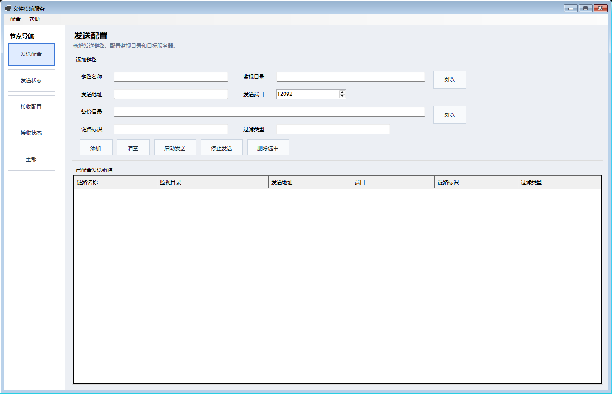
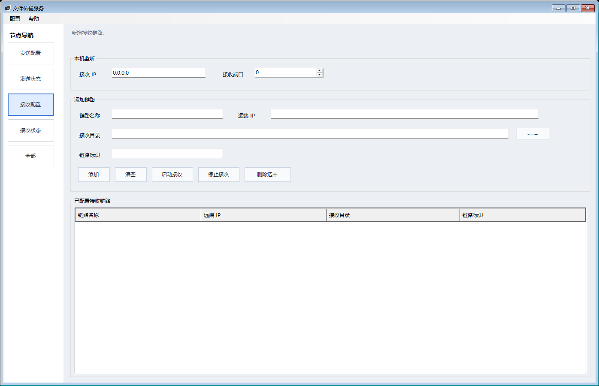
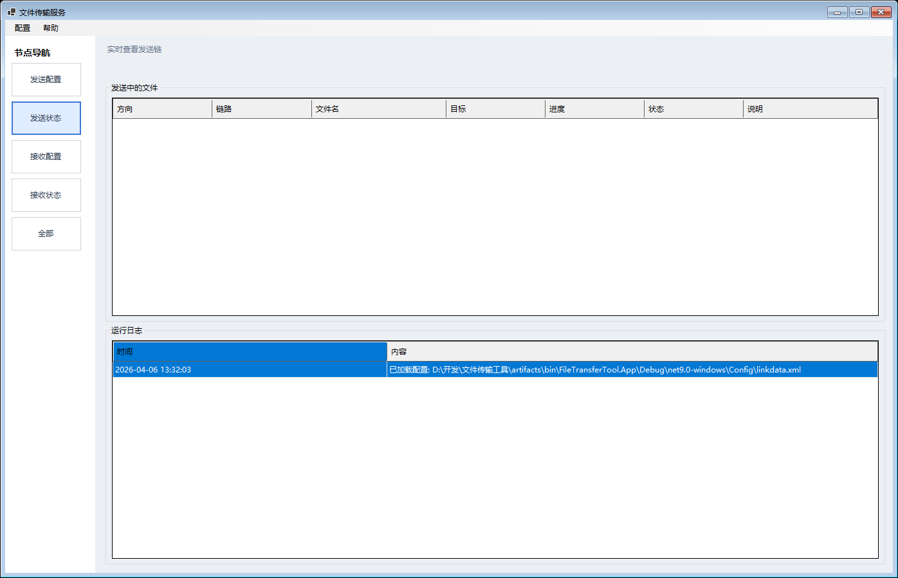
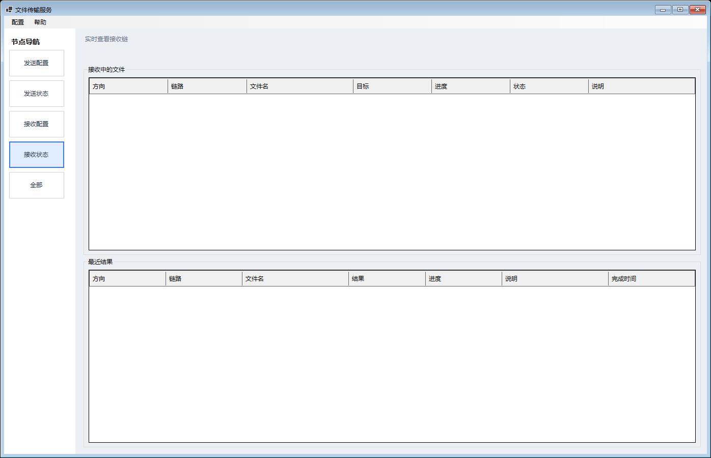
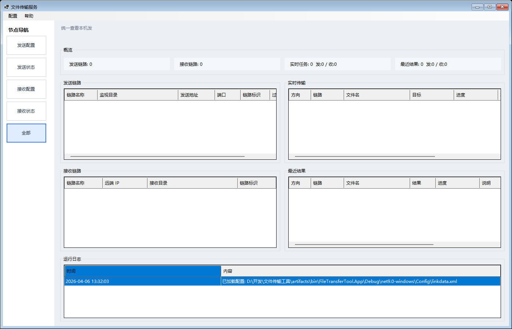

# 文件传输工具产品文档

版本：v1.1  
发布日期：2026-05-23  
适用平台：Windows 10/11、Windows Server

## 1. 产品概述

文件传输工具是一套面向 Windows 服务器的目录级文件传输节点程序。每台部署节点都可以同时作为发送端、接收端或中转节点，用于在多台服务器之间按目录、链路标识和端口自动转发文件。

工具基于 Windows Forms 和 .NET 9 开发，发布形态为 `win-x64` 自包含包。目标服务器通常不需要额外安装 .NET Desktop Runtime。

## 2. 产品定位

本工具适合需要在多台 Windows/Windows Server 之间稳定交换文件的场景，例如业务资料下发、结果文件回传、中间节点转发、大文件传输和服务器间定时归档。

它不依赖中心服务端，每台机器都运行同一套程序，通过配置发送链路和接收链路组合成单向、多跳或中转链路。

## 3. 核心能力

- 发送链路：监控本机目录，自动发现新增或变更后的正式文件。
- 接收链路：监听指定 IP 和端口，按链路标识将文件落盘到对应目录。
- 中转节点：同一台服务器可以一边接收、一边继续发送，支持 `A -> B -> C` 这类链式传输。
- 大文件传输：按 1 MB 分块发送，避免一次性加载完整文件。
- 断点续传：接收端返回已落盘偏移量，发送端从确认位置继续发送。
- 安全落盘：接收中的文件先写入 `.part`，完成后再改成正式文件名。
- 备份归档：发送成功后可转存到备份目录；未配置备份目录时会删除源文件。
- 状态查看：提供发送状态、接收状态、最近结果、运行日志和全局总览。
- 配置持久化：链路配置保存到 `Config\linkdata.xml`，仓库提供 `Config\linkdata.example.xml` 模板。

## 4. 目标用户

- 服务器运维人员：负责部署、启动、停止和排查传输节点。
- 系统管理员：负责链路规划、目录权限和端口放行。
- 项目交接人员：通过产品文档和操作说明完成环境复现和日常使用。

## 5. 典型部署场景

### 5.1 单向传输

服务器 A 配置发送链路，监控本地目录；服务器 B 配置接收链路，监听端口并接收文件。双方使用相同的链路标识。

### 5.2 中转传输

服务器 B 同时配置接收链路和发送链路。B 接收 A 的文件后，将接收目录作为下一跳发送链路的监视目录，继续发送到服务器 C。

### 5.3 多链路并行

一台服务器可以维护多条发送链路和多条接收链路。不同链路通过链路标识隔离，便于按业务线或文件类型分组。

## 6. 界面模块

| 模块 | 用途 |
|---|---|
| 发送配置 | 新增和维护发送链路，配置监视目录、目标地址、端口、备份目录、链路标识和过滤类型。 |
| 发送状态 | 查看正在发送的文件、目标地址、传输进度、状态和运行日志。 |
| 接收配置 | 配置本机监听 IP、监听端口、接收链路、远端 IP、落盘目录和链路标识。 |
| 接收状态 | 查看正在接收的文件、最近接收结果和失败原因。 |
| 全部 | 汇总发送链路、接收链路、实时任务、最近结果和运行日志。 |

## 7. 链路模型

发送链路字段：

- 链路名称：便于识别当前链路用途。
- 监视目录：发送端需要自动扫描和监听的目录。
- 发送地址：目标接收节点 IP 或主机名。
- 发送端口：目标接收节点监听端口。
- 备份目录：文件发送成功后的归档目录。
- 链路标识：发送端和接收端匹配的关键字段。
- 过滤类型：允许发送的文件扩展名，支持 `*.*`、`*.txt`、`txt` 等写法，多个过滤项可用逗号、分号或竖线分隔。

接收链路字段：

- 链路名称：便于识别当前接收链路用途。
- 远端 IP：用于记录链路来源。
- 接收目录：文件最终落盘目录。
- 链路标识：必须与发送端配置保持一致。

## 8. 工作原理

1. 发送端通过 `FileSystemWatcher` 监听目录变化，并用定时扫描兜底，减少大量文件事件下的漏检。
2. 发送端等待文件长度稳定后才开始传输，尽量避免发送尚未写完的文件。
3. 发送端建立 TCP 连接，发送开始消息，包含链路标识、文件名、大小和分块大小。
4. 接收端根据链路标识找到接收目录，检查正式文件或 `.part` 文件，并返回续传偏移。
5. 发送端从接收端确认的偏移位置继续读取文件，按块发送并等待接收端确认。
6. 接收端按批次刷盘，保留 `.part` 文件作为断点续传依据。
7. 全部数据接收完成后，接收端将 `.part` 改名为正式文件，发送端执行备份或删除源文件。

## 9. 运行环境

- Windows 10/11 或 Windows Server。
- 需要交互式桌面会话；Windows Server 建议启用 Desktop Experience。
- 发布包为 `win-x64` 自包含包。
- 节点之间网络互通，接收端口允许入站访问。
- 发送目录、接收目录和备份目录具备读写权限，并预留足够磁盘空间。

## 10. 配置文件

程序启动时读取：

```text
Config\linkdata.xml
```

仓库提供模板：

```text
Config\linkdata.example.xml
```

首次部署可复制模板：

```powershell
Copy-Item Config\linkdata.example.xml Config\linkdata.xml
```

配置中的 `链路标识` 是发送与接收匹配的核心字段。发送端填写的标识必须能在接收端配置中找到。

## 11. 发布与部署

生成 v1.1 自包含发布目录：

```powershell
dotnet publish FileTransferTool.App\FileTransferTool.App.csproj `
  -c Release `
  -r win-x64 `
  --self-contained true `
  -o artifacts\publish\FileTransferTool.App\win-x64
```

打包发布文件：

```powershell
Compress-Archive `
  -Path artifacts\publish\FileTransferTool.App\win-x64\* `
  -DestinationPath artifacts\release\FileTransferTool-win-x64-v1.1.zip `
  -Force
```

部署步骤：

1. 将发布目录或 zip 包复制到目标服务器。
2. 准备 `Config\linkdata.xml`。
3. 确认防火墙放行接收端口。
4. 双击运行 `FileTransferTool.App.exe`。
5. 在界面中加载配置并启动发送、接收或全部链路。

## 12. 验收检查

- `dotnet build FileTransferTool.sln -c Release` 生成成功。
- 发布目录包含 `FileTransferTool.App.exe`、运行时文件和 `Config\linkdata.xml`。
- 接收节点能正常监听指定 IP 和端口。
- 发送节点能发现测试文件并完成传输。
- 断线或中断后保留 `.part` 文件，并能从偏移位置继续传输。
- 发送成功后源文件按配置进入备份目录或被删除。

## 13. 注意事项

- 不要把生产环境的 `Config\linkdata.xml` 提交到仓库。
- 接收目录和下一跳发送链路的监视目录一致时，可实现中转模式。
- 大文件传输时建议使用稳定网络，并为接收目录预留至少 2 倍单文件大小的可用空间。
- 多链路部署时，链路标识应保持唯一且可读，避免不同业务误投递。
- 若目标目录已有同名完整文件，接收端会跳过并返回成功状态。

## 14. 软件截图

### 主界面默认



### 发送配置



### 接收配置



### 发送状态



### 接收状态



### 全部总览


